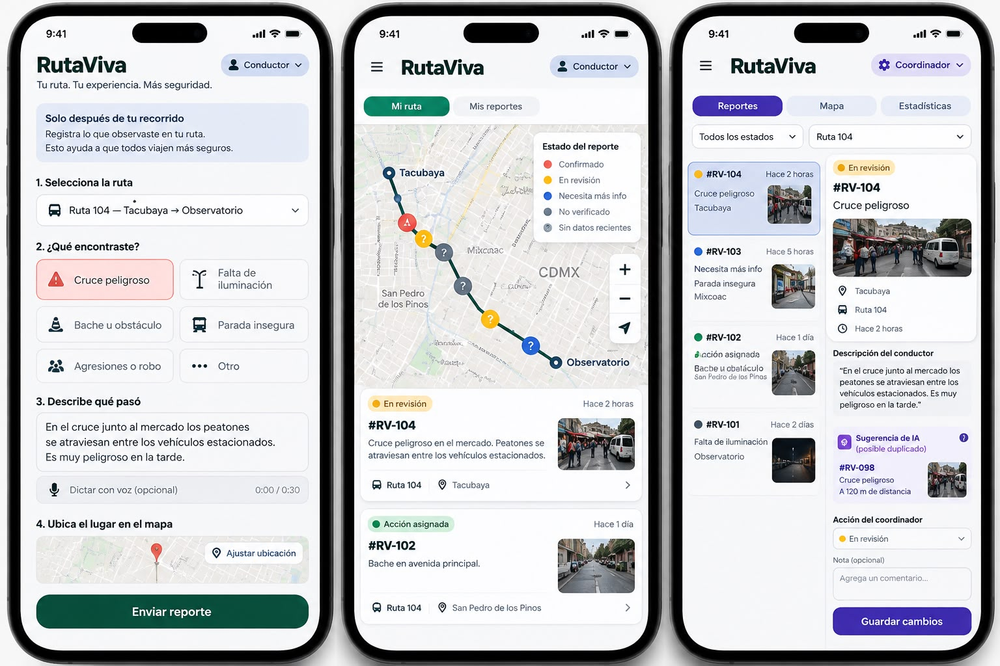
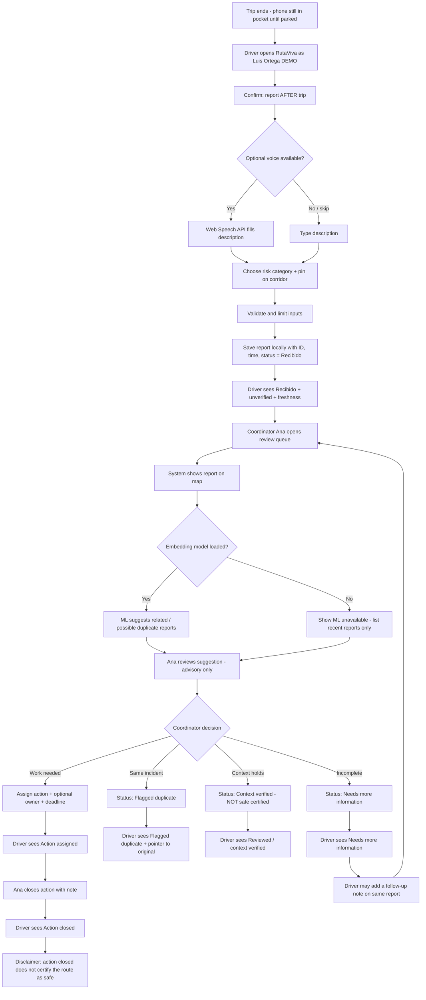
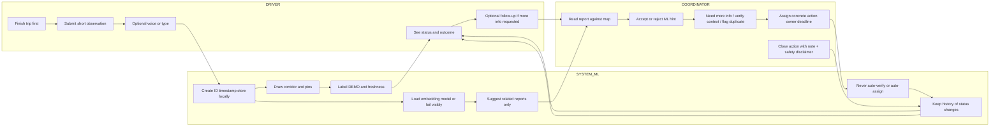

# RutaViva — Pre-code packet (Week 7)

**Course:** 2041 — Business Bending  
**Project:** RutaViva — From a driver’s observation to a verified action  
**Student:** Miguel Bravo  
**Team:** Team 6  
**Role:** OPERATOR  
**Chapter:** The Holy Driver  
**Primary vacuum:** COLECTIVO LAYER — Safety + Usable Route Data  
**Primary Blueprint condition:** #3 Human verification  
**Prototype type:** Phone-first web app (not ride-hailing)  
**Data policy:** All people, routes, reports, and coordinates in this prototype are **DEMO / SIMULATED DATA**.

This packet was the pre-code contract. Approvals are recorded in `docs/DECISIONS.md` (2026-09-27). Application language is **clear Mexican Spanish**; documentation is **English**.

---

## 1. Problem, in my own words (OPERATOR lens)

I am not trying to invent a new way for drivers to “be more careful.” Colectivo drivers in this fictional corridor already see the same broken stop, flooded dip, or dark stretch on every run. What is missing is an operator loop: a short observation after the trip ends, a human who can say “this is incomplete,” “this looks like the same report,” or “this is now someone’s job,” and a way for the driver to see that the report did not disappear.

As operator, my job is not to score drivers or certify a route as safe. My job is to keep the chain honest: receive, review, verify context, assign or close an action, and show uncertainty in public. If the machine suggests a duplicate, that is a hint for me. If I close an action, that means the assigned work was recorded as done — not that passengers should trust the street.

The vacuum I am filling is **usable safety data with a human owner**, not live tracking and not a driver leaderboard.

---

## 2. Exact first user and the coordinator’s role

### First user (driver)

**Name (DEMO):** Luis Ortega  
**Role:** Driver on one fictional Mexico City colectivo corridor: **Ruta DEMO-TO1 — Corredor Tacubaya–Observatorio** (simulated; inspired by that stretch, not an official route).  
**Device:** Personal phone, used **after the trip is complete**, never while driving.  
**Job in the prototype:** Submit one short safety observation (text required; optional voice-to-text), pick a risk category, drop a pin on the corridor (or confirm a suggested stop), and later open “My reports” to see whether the report was received, reviewed, needs more information, or has an assigned / completed action.

Luis is not a passenger, not a dispatcher, and not a city official. He does not compete with other drivers. He is not paid per report.

### Coordinator (operator surface)

**Name (DEMO):** Ana Beltrán  
**Role:** Corridor coordinator for Ruta DEMO-TO1 (simulated operator, not a police or insurance role).  
**Job in the prototype:** Open the review queue, read the report against the map, mark incomplete information, verify **context** (not “guilt” and not “the route is safe”), flag a likely duplicate, assign a concrete action with optional owner and deadline, and close an action with a note. Ana is the only actor who can change verification status. ML never publishes, never verifies, and never assigns.

### Demo identity rule

The app uses a **role switcher** with invented identities only. No real accounts, no email, no phone numbers, no passwords.

---

## 3. Measurable success definition (before the module closes)

The prototype succeeds if a reviewer can complete this loop on a phone-width screen **without us claiming live tracking, crash prediction, or safety certification**:

| # | Criterion | How we measure it |
|---|-----------|-------------------|
| S1 | Post-trip report exists | A driver can create a report **only** from a “trip complete” state. There is no in-trip / while-driving capture flow. |
| S2 | Map is honest | The corridor and report pins render on Leaflet + OSM. A persistent **DEMO / SIMULATED DATA** banner is visible. No GPS tracking of a moving vehicle. |
| S3 | Closed loop for the driver | After coordinator actions, the driver view shows at least: received, reviewed, needs more information, action assigned, action closed. |
| S4 | Human verification | An ML “related / possible duplicate” suggestion never auto-changes status. Coordinator must click an explicit decision. |
| S5 | Real ML, with fallback | Semantic similarity uses an actual embedding model in the browser. If the model fails to load, the UI labels **ML unavailable** and still lists recent reports without pretending keyword matching is ML. |
| S6 | Voice is optional | Web Speech API can fill the description field when supported; typed input always works. |
| S7 | Action ≠ certified safe | Closing an action displays a fixed disclaimer: the action is closed; the route is **not** certified safe. |
| S8 | Shadow clause | No driver safety score, no ranking, no hidden log of “who reported most,” no automatic discipline. |

**Module-close bar:** S1–S8 all true on a deployed Vercel URL, using only simulated data.

---

## 4. Mockup specification (image-generated screen)

**Purpose of the image:** One evidence frame for the packet and later README. It is a **composite operator phone screen**, not a production screenshot. Generate as a single 9:16 mobile UI mockup.

**File:** `docs/mockups/rutaviva-loop-frame.png`



### Prompt / art direction

- Style: clean civic-ops mobile web UI, not a consumer ride-hailing app. No car icons chasing passengers. No surge colors. No 5-star driver badge.
- Device: tall phone frame, light background, high contrast, large tap targets.
- Language on screen: Spanish UI labels (product), with a small English **DEMO / SIMULATED DATA** ribbon at the top.
- Typography: sans-serif, municipal/utility feel.

### Layout (top → bottom)

1. **Top ribbon (always on):** yellow/amber bar: `DEMO / DATOS SIMULADOS — No es seguimiento en vivo · No certifica seguridad`.
2. **Header:** `RutaViva` + role chip `Coordinadora · Ana Beltrán (DEMO)` + route chip `Ruta DEMO-TO1`.
3. **Map card (~40% of screen):** Leaflet-like street map of a **fictionalized** Tacubaya–Observatorio corridor (Mexico City). Show a **thick corridor polyline** (not a GPS breadcrumb of a live bus). Three numbered pins:
   - Pin `RV-104` (selected): dark amber, label `Sin verificar · reciente`
   - Pin `RV-091`: gray, label `Acción cerrada · dato viejo`
   - Pin `RV-088`: outline only, label `Duplicado marcado`
   - Legend in the map corner: `Sin verificar` / `Reciente` / `Dato viejo` / `No disponible`
4. **Selected report card:**
   - ID `RV-104`
   - Category chip `Parada bloqueada`
   - Description (short): `Después del viaje: puestos fijos cubren la parada frente al Mercado Tacubaya (DEMO). Pasajeros bajan en el segundo carril.`
   - Timestamp `27 Sep 2026, 14:12` + freshness `Reciente (< 24 h)`
   - Status stepper: `Recibido → En revisión → Acción asignada` (current: En revisión)
5. **ML advisory strip (distinct from status):** pale purple, icon “sugerencia”: `Posible relacionado: RV-088 (similitud 0.81) · Solo aviso · Ana decide`. Buttons disabled-looking for auto-verify. Text: `La IA no verifica ni publica.`
6. **Coordinator action row:** two large buttons `Pedir más información` and `Asignar acción`. Secondary text links: `Verificar contexto` · `Marcar duplicado` · `Cerrar acción`.
7. **Assigned action preview (draft):** `Dueño: Taller de paradas (DEMO)` · `Plazo: 3 Oct 2026` · note field placeholder `Acción concreta, no certificado de ruta`.
8. **Footer tab bar:** `Mapa` · `Cola` · `Historial` — not `Viaje` / `Tarifa` / `Chofer`.

### Must appear in the image

- Driver contribution visible (the report text and ID).
- Map with corridor + observation locations.
- Review status stepper.
- Coordinator action controls.
- Uncertainty labels (unverified / recent / stale / unavailable).
- Explicit DEMO labeling.
- Explicit “AI does not verify” copy.

### Must not appear

- Live bus marker moving along the route.
- ETA, fare, passenger request, 5-star rating.
- “Ruta segura” / “Safety score 92”.
- Real personal data or real operator logos presented as official.

---

## 5. Mermaid flowchart — complete report-to-action loop



---

## 6. Mermaid swimlane — DRIVER / SYSTEM-ML / COORDINATOR



---

## 7. Global benchmark: Digital Matatus — difference and localization

**Digital Matatus** (University of Nairobi, Columbia CSUD, MIT Civic Data Design Lab, Groupshot) mapped Nairobi’s matatu network with phones, published open GTFS-like data, and produced a city transit map so an informal system could be seen as a system. Its core product is **route and stop infrastructure data** for navigation, planning, and public recognition of the network. Later work (including tools such as Twiga Tatu) collected additional vehicle-condition notes, but the famous deliverable remains the map and the open feed.

**How RutaViva localizes and differs:**

| Dimension | Digital Matatus | RutaViva (this prototype) |
|-----------|-----------------|---------------------------|
| Geography | Nairobi matatus, city-scale | One **fictional** CDMX colectivo corridor |
| Primary object | Routes, stops, GTFS, public map | Post-trip **safety observation → owned action** |
| Who captures | Field collection to describe the network | Driver report **after** a completed trip |
| Who decides | Data cleaning / map publication | Coordinator **human verification** |
| ML | Not the core of the original mapping story | On-device semantic duplicate **suggestions** only |
| Claim | “You can see the system” | “You can see what happened to this report” |
| Safety | Map is not a crash predictor | Closing an action is **not** a safety certificate |

RutaViva borrows the lesson that **informal transit knowledge lives with the people who run the street**, and that a phone is enough infrastructure. It does **not** try to republish a city GTFS. For Mexico City, the operator vacuum we are bending is the gap between a driver’s observation and a verified, visible action on a single corridor.

---

## 8. Three-sentence, three-year product vision

In year one, one corridor keeps a shared, human-reviewed log of hazards and stop problems so drivers can see that reporting after a trip produces a status, not silence. In year two, a small set of corridors reuse the same loop — report, freshness, coordinator decision, owned action — without scoring drivers or selling their knowledge. In year three, the public artifact is a corridor action board that cities and operator groups can inspect, while live tracking, passenger matching, and automated discipline stay out of scope on purpose.

---

## 9. Explicit scope cuts

Out of scope for Week 7 (and not to be “just quickly added”):

- Ride-hailing, passenger booking, payments, fares, ETAs.
- Real-time vehicle tracking or simulated moving buses presented as live.
- Crash prediction, risk scoring of drivers, or “safety certified” routes.
- Multi-route city coverage, GTFS export, or OSM editing.
- Real user accounts, SMS, WhatsApp, or a shared production database.
- Native iOS/Android apps, dashcams, IoT, or any in-vehicle hardware.
- In-trip reporting, voice while driving, or gamified report streaks.
- Automatic accusations, public naming of other drivers, or passenger shaming.
- Training or hosting a custom GPU model; we use a lightweight browser model only.
- Backend/API unless a later decision explicitly accepts auth + row-level access.

---

## 10. Architecture and Dragon Stack table

### Architecture (proposed)

Phone-first **client-only SPA**. Demo role switcher. Seed + user reports in `localStorage`. No server secrets. Deploy static build to Vercel.

```text
[Driver or Coordinator browser]
        |
        v
 Vite + React + TypeScript  (UI, validation, history)
        |
        +--> Leaflet + OSM tiles     (corridor + pins)
        +--> Web Speech API          (optional STT)
        +--> Transformers.js MiniLM  (embeddings in-browser)
        +--> localStorage            (reports, audit history)
```

### Dragon Stack

| Layer | What we will actually ship | What we will not pretend |
|-------|----------------------------|--------------------------|
| **GEODATA / MAPS** | Leaflet map, OSM tiles, one simulated corridor polyline, report lat/lng pins, status-colored markers, freshness legend | Live fleet GPS, turn-by-turn, traffic, official SEMOVI map |
| **ML** | `Xenova/all-MiniLM-L6-v2` (or equivalent MiniLM) via Transformers.js; cosine similarity vs open reports; advisory “related / possible duplicate” list with scores | Keyword equals ML; auto-merge; auto-verify; cloud LLM judging guilt |
| **VOICE** | Optional `webkitSpeechRecognition` / `SpeechRecognition` into the description field; user must review text before submit | Always-on mic, in-drive capture, speaker identification |

### Data object (each report)

| Field | Required | Notes |
|-------|----------|--------|
| `id` | yes | e.g. `RV-104` |
| `routeId` / fictional route name | yes | Ruta DEMO-TO1 |
| `lat` / `lng` | yes | Simulated / user-placed on corridor |
| `locationLabel` | yes | Fictional stop or landmark label |
| `riskCategory` | yes | Closed list (see DECISIONS) |
| `description` | yes | Length-capped plain text |
| `createdAt` | yes | ISO timestamp |
| `verificationStatus` | yes | Workflow status |
| `freshness` | derived | recent / stale / unavailable |
| `coordinatorNote` | no | |
| `assignedAction` | no | Concrete work, not a verdict |
| `responsibleOwner` | no | DEMO org or role name |
| `deadline` | no | |
| `history[]` | yes | Meaningful status changes only |

### Uncertainty labels (visible)

| Label | Meaning |
|-------|---------|
| Unverified | Coordinator has not verified context |
| Recent | Created within the freshness window (proposed 24 h) |
| Stale | Older than the freshness window |
| Unavailable | Model, map tiles, or report body cannot be shown |

---

## 11. Test plan

### Mechanical tests

| ID | Test | Pass condition |
|----|------|----------------|
| M1 | Create report | Unique ID, timestamp, status `received`, appears on map |
| M2 | Input limits | Description over max length is blocked; empty submit blocked |
| M3 | Role switch | Driver cannot assign actions; coordinator can |
| M4 | Map | Corridor polyline + at least one pin visible; DEMO banner visible |
| M5 | Voice fallback | With speech unsupported, text submit still works |
| M6 | ML path | With model loaded, related reports show a numeric similarity, labeled advisory |
| M7 | ML fallback | With model forced unavailable, UI says `ML unavailable`; no “ML” badge on a keyword list |
| M8 | Duplicate flag | Status changes only after coordinator confirm; driver sees duplicate pointer |
| M9 | Need more info | Driver sees the request; can add follow-up; history records both events |
| M10 | Assign + close | Owner/deadline optional; close requires a note; disclaimer visible |
| M11 | History | Status changes appear in order; cosmetic UI toggles do not spam history |
| M12 | Persistence | Reload keeps reports in localStorage |
| M13 | No live claims | UI copy has no “en vivo”, “ETA”, “certificada segura”, or driver score |

### Persona tests

| ID | Persona | Script | Pass condition |
|----|---------|--------|----------------|
| P1 | Luis (driver) | Finishes a simulated trip, records optional voice, edits one word, submits a blocked-stop report, leaves, comes back | Sees `Recibido`, then later coordinator outcomes without a score |
| P2 | Ana (coordinator) | Opens queue, reads RV-104 vs map, uses ML hint on RV-088, rejects auto-merge mentally, flags duplicate **or** assigns action | Final status is Ana’s click, not the model’s |
| P3 | Skeptical reviewer (course) | Looks for surveillance, quantity rewards, and safety certification | Finds DEMO labels, no leaderboard, close-disclaimer present |
| P4 | No-mic phone | Completes full driver loop typing only | Feature-complete without voice |
| P5 | Slow network | Model fails to load | Fallback copy is honest; review still possible |

---

## 12. Security-floor checklist

- [ ] Invented demo identities only (Luis Ortega, Ana Beltrán). No real names, emails, phones, photos of real people.
- [ ] No signup, no OAuth, no password fields.
- [ ] Prototype data stays in the browser (`localStorage`) unless a later packet amends this **and** adds auth + row-level access first.
- [ ] No API keys or secrets in the repo. OSM public tiles only. Model loaded from the official Transformers.js / Hugging Face pipeline used by the library, with failure handled in UI.
- [ ] Validate and limit: category enum, description max length, coordinate bounds around the fictional corridor, note max length.
- [ ] Untrusted report text is **not** sent to a remote LLM. Embeddings run locally. If a remote call is ever added, it must be refused until a new security review.
- [ ] Do not interpolate raw report text into an unbounded prompt. For local embeddings, pass truncated plain text only.
- [ ] No hidden analytics of individual drivers. No “silent” extra fields beyond the visible report schema.
- [ ] DEMO / SIMULATED DATA labeled on map, seed reports, and README.
- [ ] Closing copy forbids reading the prototype as a safety certification.

---

## 13. Blueprint compliance matrix

| # | Condition | How RutaViva complies | How we could fail (do not do) |
|---|-----------|------------------------|-------------------------------|
| 1 | Direct value | Driver “My reports” shows received / reviewed / needs info / action assigned / action closed | Reports vanish into an admin-only log |
| 2 | Visible uncertainty | Unverified, recent, stale, unavailable on map and cards | Treating all pins as current truth |
| 3 | Human verification | ML advisory only; Ana confirms; no auto-publish of accusations | One-click “AI verified” or public blame |
| 4 | Low friction | One route, phone web, post-trip only, no extra hardware | In-drive capture, multi-city, dashcam |
| 5 | Incentive alignment | No points, streaks, speed, or quantity rewards | Badges for “most reports” or faster trips |
| 6 | Shadow clause | No individual safety score, no hidden surveillance, no auto discipline, knowledge stays visible in the shared report | Secret scoring, scraping reports for a vendor without showing drivers |

Primary emphasis for grading this OPERATOR build: **#3 Human verification**, without dropping 1, 2, 4, 5, and 6.

---

## 14. Proposed implementation stages

Do **not** start these until this packet is approved.

| Stage | Meaningful commit (proposed message) | Outcome | Deploy |
|-------|--------------------------------------|---------|--------|
| 0 | Packet only (this folder) | `docs/PACKET.md`, `docs/DECISIONS.md` | none |
| 1 | `chore: scaffold Vite React TypeScript app with DEMO shell` | App boots, role switcher, DEMO banner, no fake ML | **Vercel #1** (shell) |
| 2 | `feat: seed simulated corridor, reports, and Leaflet map` | Polyline + pins + freshness legend | (same preview or update #1) |
| 3 | `feat: post-trip driver report with text and optional speech` | Create report, validation, localStorage | |
| 4 | `feat: coordinator review, actions, history, driver status` | Full human loop without ML | **Vercel #2** (closed loop) |
| 5 | `feat: in-browser MiniLM related-report suggestions with fallback` | Real embeddings + honest failure | update #2 |
| 6 | `docs: README evidence, copy pass, submission checklist` | Claims match the product | final URL freeze |

**Minimum five meaningful commits after scaffold:** stages 1–5.  
**Minimum two Vercel deployments:** (1) DEMO shell + map, (2) full loop + ML fallback.

Suggested Git discipline: one concern per commit; never commit `.env` secrets; never commit `node_modules`.

---

## 15. Evidence and final submission checklist

### Evidence to capture (after coding, not now)

- [ ] Vercel URL (production) + one preview URL if available
- [ ] Phone-width recording or screenshots: driver submit → coordinator decision → driver outcome
- [ ] Screenshot of ML advisory **and** of ML unavailable fallback
- [ ] Screenshot of DEMO banner and “action closed ≠ safe route” disclaimer
- [ ] Short note of model name and that inference is local
- [ ] This packet + `DECISIONS.md` in the repo

### Final submission checklist

- [ ] Packet reviewed; assumptions approved or amended in DECISIONS
- [ ] App is not ride-hailing
- [ ] Dragon Stack all three present (maps, real ML, voice + fallback)
- [ ] Seed data labeled DEMO / SIMULATED
- [ ] No live tracking / ETA / crash prediction / safety certification claims
- [ ] Report schema complete (ID, route, location, category, description, time, status, optional note/action/owner/deadline, history)
- [ ] Driver can see received / reviewed / needs info / assigned / closed
- [ ] Coordinator can request info, verify context, flag duplicate, assign, close
- [ ] Blueprint 1–6 visible in the UI, not only in this document
- [ ] Security floor items checked
- [ ] At least five meaningful commits and two Vercel deploys documented

---

*End of packet. Next file: `docs/DECISIONS.md`.*
